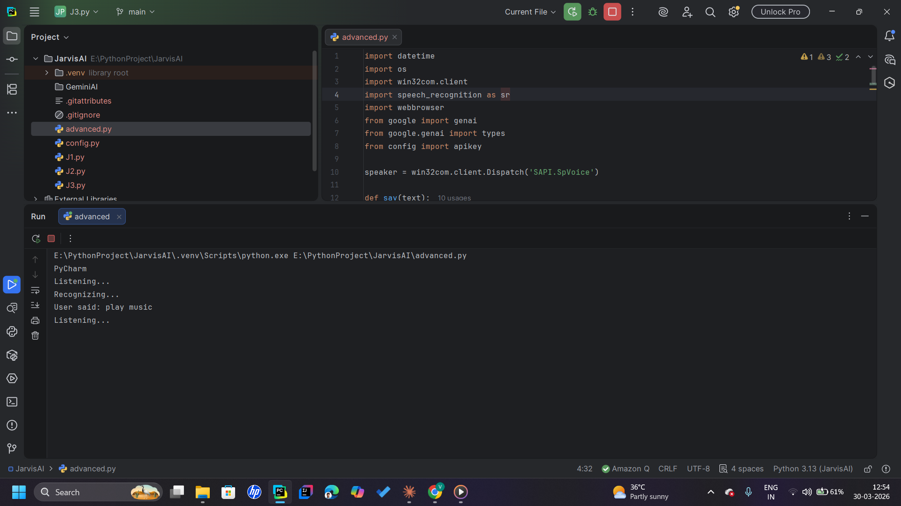

# 🤖 JarvisAI

> A personal AI desktop assistant powered by **Gemini 2.5 Flash** — goes far beyond basic voice commands to deliver intelligent, context-aware responses.

<p align="center">
  
</p>

---

## 💡 What it does

JarvisAI is a fully functional AI desktop assistant built with Python. Unlike simple voice assistants that match keywords, JarvisAI uses Google's **Gemini 2.5 Flash API** to understand complex natural language — so you can have real conversations with it, ask follow-up questions, and get intelligent answers.

**Key capabilities:**
- 🎙️ Voice recognition — speak naturally, no rigid commands needed
- 🧠 Powered by Gemini 2.5 Flash for context-aware reasoning
- 🖥️ Desktop automation — open apps, search the web, run tasks
- 💬 Natural language understanding — ask anything, get intelligent answers

---

## 🛠 Tech Stack

| Layer | Technology |
|---|---|
| Language | Python 3 |
| AI Model | Google Gemini 2.5 Flash API |
| Voice Input | SpeechRecognition library |
| Text-to-Speech | pyttsx3 / gTTS |
| Automation | Automation libraries (subprocess, webbrowser, os) |

---

## 🚀 Getting Started

### Prerequisites
- Python 3.8 or higher
- A Google Gemini API key (free at [aistudio.google.com](https://aistudio.google.com))

### Installation

```bash
# 1. Clone the repository
git clone https://github.com/VK-learner/JarvisAI.git
cd JarvisAI

# 2. Install dependencies
pip install -r requirements.txt

# 3. Add your Gemini API key
# Open the main file and replace YOUR_API_KEY with your actual key

# 4. Run JarvisAI
python main.py
```

---

## 📁 Project Structure

```
JarvisAI/
├── main.py            # Entry point — starts the assistant
├── gemini_api.py      # Gemini API integration & response handling
├── voice.py           # Speech recognition & text-to-speech
├── commands.py        # Desktop automation commands
├── requirements.txt   # Python dependencies
├── screenshot.png     # Demo screenshot
└── README.md
```

---

## 🔍 How it works

1. **You speak** → Microphone captures your voice
2. **Speech recognition** converts it to text
3. **Gemini 2.5 Flash** processes your query with full context
4. **JarvisAI responds** — both speaks and displays the answer
5. **Automation triggers** if you asked to open an app, search, etc.

---

## 🌱 What I learned

- Integrating LLM APIs (Gemini) into real Python applications
- Handling real-time audio input with `SpeechRecognition`
- Building context-aware conversation loops beyond simple if/else commands
- The difference between rule-based and AI-driven assistants

---

## 🗺 Roadmap

- [ ] Add a GUI interface (Tkinter or PyQt)
- [ ] Persistent conversation memory across sessions
- [ ] Schedule reminders and calendar integration
- [ ] WhatsApp / email automation

---

## 📜 License

MIT License — feel free to use and modify.

---

*Built by [Vaibhav Kulkarni](https://github.com/VK-learner) · [LinkedIn](https://www.linkedin.com/in/vaibhav-kulkarni-b223b7268)*
